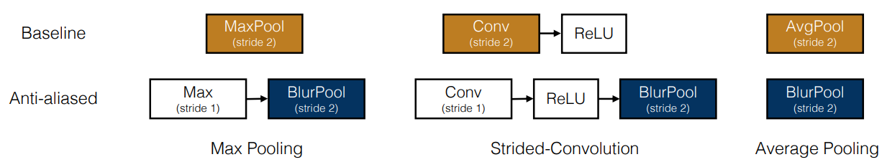

# BlurPool Layers
Pytorch implementation of BlurPool layers (1D, 2D and 3D).
BlurPool layers perform anti-aliasing downsampling, as described in the paper 'Making Convolutional Networks Shift-Invariant Again'.
This implementation includes BlurPool1d, BlurPool2d, and BlurPool3d classes for 1D, 2D, and 3D data, respectively.



# Example Usage

```python
blur_pool_2d = BlurPool2d(in_channels=1, filter_size=4, stride=2, padding=0)

input_2d = torch.randn(1, 1, 10, 10)

# BlurPool2d / AvgPool2d
output_blurpool = blur_pool_2d(input_2d)
print("BlurPool2d out:", output_blurpool.shape)

avg_pool_2d = nn.AvgPool2d(kernel_size=4, stride=2, padding=1) # AvgPool2d for comparison
output_avgpool = avg_pool_2d(input_2d)
print("AvgPool2d out:", output_avgpool.shape)
```

# Citation

Original paper: https://arxiv.org/pdf/1904.11486

```bibtex
@misc{1904.11486,
Author = {Richard Zhang},
Title = {Making Convolutional Networks Shift-Invariant Again},
Year = {2019},
Eprint = {arXiv:1904.11486},
}
```